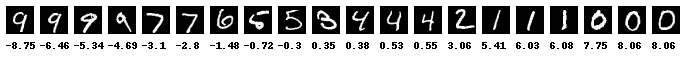

# RankNet on MNIST

## Ranking

```
label 9 < label 8 < label 7 < ...  < label 1 < label 0
```

## Result



Some info messages are omitted.

```bash
$ CUDA_VISIBLE_DEVICES=$(empty-gpu-device) hy main.hy

Using TensorFlow backend.
_________________________________________________________________
Layer (type)                 Output Shape              Param #
=================================================================
reshape_1 (Reshape)          (None, 28, 28, 1)         0
_________________________________________________________________
conv2d_1 (Conv2D)            (None, 12, 12, 8)         208
_________________________________________________________________
conv2d_2 (Conv2D)            (None, 4, 4, 16)          3216
_________________________________________________________________
flatten_1 (Flatten)          (None, 256)               0
_________________________________________________________________
dense_1 (Dense)              (None, 10)                2570
_________________________________________________________________
dense_2 (Dense)              (None, 1)                 11
=================================================================
Total params: 6,005
Trainable params: 6,005
Non-trainable params: 0
_________________________________________________________________
____________________________________________________________________________________________________
Layer (type)                     Output Shape          Param #     Connected to
====================================================================================================
input_1 (InputLayer)             (None, 28, 28)        0
____________________________________________________________________________________________________
input_2 (InputLayer)             (None, 28, 28)        0
____________________________________________________________________________________________________
sequential_1 (Sequential)        (None, 1)             6005        input_1[0][0]
input_2[0][0]
____________________________________________________________________________________________________
lambda_1 (Lambda)                (None, 1)             0           sequential_1[1][0]
sequential_1[2][0]
====================================================================================================
Total params: 6,005
Trainable params: 6,005
Non-trainable params: 0
____________________________________________________________________________________________________
Epoch 1/5
2000/2000 [==============================] - 18s - loss: 0.3364 - mse: 0.0800 - val_loss: 0.3168 - val_mse: 0.0653
Epoch 2/5
2000/2000 [==============================] - 15s - loss: 0.2588 - mse: 0.0506 - val_loss: 0.2623 - val_mse: 0.0490
Epoch 3/5
2000/2000 [==============================] - 15s - loss: 0.2380 - mse: 0.0435 - val_loss: 0.2360 - val_mse: 0.0441
Epoch 4/5
2000/2000 [==============================] - 15s - loss: 0.2266 - mse: 0.0389 - val_loss: 0.2442 - val_mse: 0.0426
Epoch 5/5
2000/2000 [==============================] - 15s - loss: 0.2226 - mse: 0.0363 - val_loss: 0.2309 - val_mse: 0.0416
```

